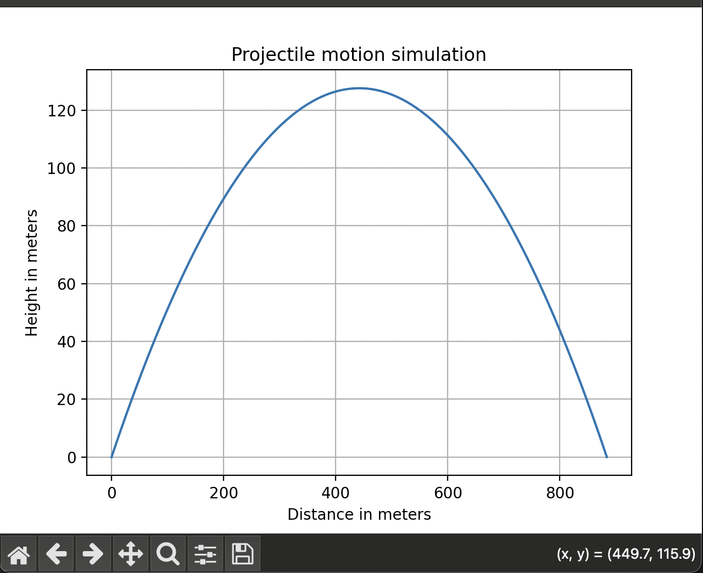

This is a basic python program that simulates 2D projectile motion.
Upon running it, the user is prompted to input #1 the initial velocity and #2 the angle of launch in degrees
The program then caluculates the full trajectory, plots it in matplotlib, and prints some useful stats

# Requirements to run the program
  - Python3
  - NumPy
  - Matplotlib

# The dependancies can be installed by running the following in the terminal
  - pip install numpy matplotlib

# To run the program, simply type the following in the terminal
  - python3 main.py

# Screenshot of a graph generated with the initial velocity being 100 m/s and the angle being 30 degrees.

